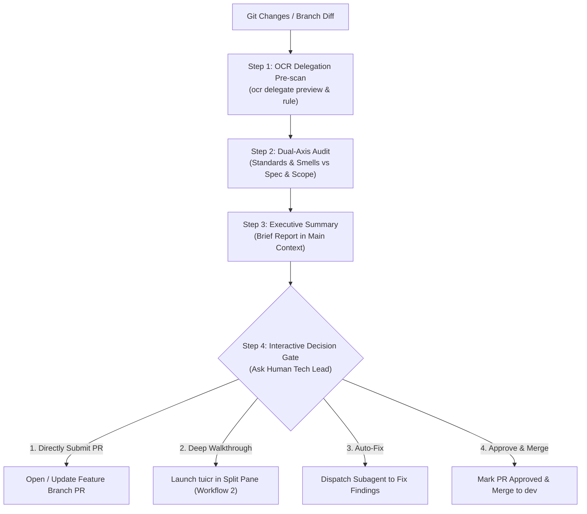

# Code Review & Guided Walkthrough

A terminal-native review workflow designed to rebuild developer mental models, prevent vibe coding degradation, and provide deep architectural inspection.

Supports three streamlined workflows:
1. **Delegation Pre-Review & Decision Gate (Default Delivery Flow)**: Uses Open Code Review (OCR) delegation mode for deterministic file clustering and targeted rule audits, presents an executive summary, and actively asks the human Tech Lead how to proceed (submit PR, launch `tuicr`, auto-fix, or approve & merge).
2. **Interactive Terminal Review (`tuicr` + AI 领读)**: Opens an interactive split-pane TUI (Ghostty + Herdr / tmux) where the AI leaves reading guides and the user inspects with Vim keybindings.
3. **Formal Dual-Axis Audit**: Standards (code smells & language safety) vs. Spec (functional correctness & scope creep).

---

## 🚀 Workflow 1: Delegation Pre-Review & Decision Gate (Recommended Default)

Use this immediately after `/implement` completes work on a ticket/feature branch, or when evaluating recent commits before opening/merging a PR.



### Step 1: OCR Delegation Pre-Scan
Leverage Open Code Review (`ocr`) in delegation mode (no extra API key needed) to extract file topology and domain-specific rules:

```bash
# 1. Preview reviewable files and change volume
ocr delegate preview

# 2. Extract resolved review rules for changed files (e.g. Go NPE, Rust lifetime, Svelte reactivity)
ocr delegate rule <changed-file-1> <changed-file-2> ...
```
*Note: If `ocr` is not installed on the system, emulate the grouping and language rules natively.*

### Step 2: Dual-Axis Audit
Run focused checks against the diff:
1. **Standards & Smells**:
   - Apply language-specific rules extracted from `ocr delegate rule`.
   - Check Fowler Code Smells: Speculative Generality (YAGNI), Feature Envy, Primitive Obsession, Reinventing Stdlib.
2. **Spec & Scope**:
   - Verify every requirement in the corresponding issue / ticket DoD is satisfied.
   - Check for accidental scope creep or unrelated file modifications.

### Step 3: Executive Summary
Output a concise briefing card into the main conversation (keep it under 15 lines):

```markdown
### 📋 Code Review 自动化审计简报
- **审查范围**: `<X>` 个文件 (`+<ins>` / `-<del>` 行)
- **质量基线**: 单元测试 100% 通过，Linter / Clippy 零 Warning
- **潜在隐患 / 异味**: 
  - `path/to/file:L42`: [规则分类] 描述建议（无严重硬伤可标注“暂无高危缺陷”）
- **规格符合度**: 完全对齐 Ticket `<NN>` 验收标准 (DoD)
```

### Step 4: Interactive Decision Gate (提问决策门禁)
Actively ask the human developer for their explicit decision before taking irreversible Git actions:

> **请确认下一步动作：**
> 1. **(推荐) 确认无误，直接提交 PR**：由 Bot 在特性分支上提交并创建 Pull Request；
> 2. **进入 `tuicr` 终端深入交互带读**：在终端右侧分屏启动 `tuicr`，逐行阅读 AI 领读铺设的路标；
> 3. **自动修复潜在隐患**：派发 Worker Subagent 针对上述发现的问题进行针对性修复并重新运行测试；
> 4. **(针对已有 PR) 审查通过，批准并合入 `dev`**：标记 PR Review Approved 并完成合并。

---

## 🖥️ Workflow 2: Interactive Terminal Review & AI 带读 (tuicr + Herdr)

Use this when the user chooses Option 2 in the Decision Gate, or explicitly says "review this", "带我读代码", or "open tuicr".

### Step 1: Detect Terminal & Split Pane
Check the environment:
- If running under **Herdr** (`$HERDR_ENV=1`): Use the Herdr wrapper (`tuicr-wrapper-herdr.sh`).
- If running under **tmux** (`$TMUX`): Use `tuicr-wrapper.sh`.
- If running under **Zellij** (`$ZELLIJ`): Use `tuicr-wrapper-zellij.sh`.
- Otherwise: Instruct user to launch `tuicr -w` or `tuicr -r <revset>`.

### Step 2: "AI 领读" 铺路标 (Paving the Path)
**Do not let the user drown in unfamiliar code.** Before the user begins reviewing, analyze the diff and write structured, line-level notes into the session via `tuicr review add`:

```bash
tuicr review add --repo /path/to/repo --session <slug> \
  --target-file <file> --line <line> --type note \
  --username "AI-Mentor" "<Comment>"
```

**What to annotate:**
1. **宏观数据流 (Data Flow)**: Mark where inputs enter and where key state transformations happen.
2. **解构黑魔法 (De-sugaring)**: For dense or unfamiliar syntax (Rust ownership patterns, TypeScript conditional types, complex regex, subtle concurrency locks), write a 1-sentence plain explanation of what the logic translates to.
3. **隐患与防御点 (Edge Cases / Fragile Logic)**: Mark lines that require extra scrutiny (null checks, timeouts, race conditions).
4. **潜在异味 (Smells / Over-engineering)**: Mark with `--type suggestion` or `--type issue` if code violates YAGNI or reimplements standard library utilities.

### Step 3: Human Review in TUI
The user reviews in the split pane with Vim keybindings:
- `j` / `k` to navigate.
- Reads AI notes inline.
- Presses `Enter` or `c` to leave their own questions, `issue`s, or `suggestion`s.
- Quits `tuicr` (`q`) when done.

### Step 4: Retrieve Feedback & Action
Once the user finishes review, retrieve all comments:
```bash
tuicr review comments --repo /path/to/repo --session <slug>
```
- Answer user `note` questions thoroughly with simple mental models.
- Fix all `issue` and `suggestion` items in the code.

---

## 📑 Workflow 3: Automated Dual-Axis Audit (PR / Milestone Report)

Use when generating a formal markdown audit report against a base commit (`HEAD~N`, `main`, or PR).

### Axis 1: Standards & Smell Baseline
Check against repo documentation (`CODING_STANDARDS.md`, `CONTRIBUTING.md`) PLUS Fowler's Code Smell baseline:
- **Mysterious Name**: Names that obscure purpose or disguise side-effects.
- **Duplicated Code**: Identical or copy-pasted structures across hunks.
- **Feature Envy**: Logic that reaches into another module's internals rather than placing behavior with data.
- **Primitive Obsession**: Strings/numbers used where a domain type should exist.
- **Shotgun Surgery**: A single conceptual change requiring edits scattered across too many unrelated files.
- **Speculative Generality / Over-engineering**: Abstractions, hooks, or parameters added "just in case" without immediate need.
- **Reinventing Stdlib**: Writing custom helpers for operations natively supported by modern language APIs.

### Axis 2: Spec & Scope
Check against originating prompt, issue, or spec:
1. **Missing Requirements**: Features the prompt/issue requested that were skipped.
2. **Scope Creep / Unrequested Edits**: Code modified that had nothing to do with the prompt.
3. **Flawed Implementation**: Logic that compiles/runs but fails in edge cases or misses error branches.

### Report Format
```markdown
## Standards & Code Health
- `path/to/file:L42` [Smell Name]: Description and recommended inline fix.

## Spec & Requirements
- [Scope / Bug]: Discrepancy between requirement and actual implementation.

## Mental Model Summary
- 3-sentence executive summary of the overall architecture and data flow.
```
