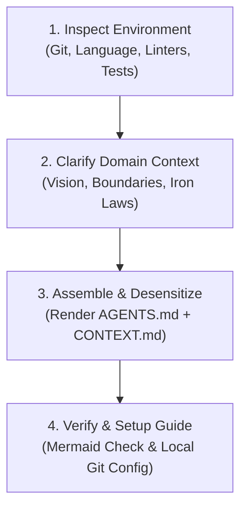

# init-agents

Generate a production-grade, battle-tested `AGENTS.md` workflow constitution and domain `CONTEXT.md` for a new or existing repository. Enforces the Master-Worker multi-agent model, Git promotion discipline, zero-warning quality gates, and strict bot attribution desensitization.

## Workflow



---

## Step 1: Inspect Environment & Auto-Detect Stack

Examine the target repository root to determine the existing toolchain:

1. **Git Status**:
   - Check if repository is initialized: `git status` or `git rev-parse --is-inside-work-tree`.
   - Check default branches (`main`, `dev`, `master`).
2. **Technology Stack & Package Manager**:
   - Rust: `Cargo.toml` ➔ `cargo clippy -- -D warnings`, `cargo fmt --check`, `cargo test`
   - TypeScript / Node / Svelte: `package.json` ➔ `npm run lint` / `pnpm check` / `biome check`, `vitest` / `jest`
   - Python: `pyproject.toml` / `requirements.txt` ➔ `ruff check`, `mypy`, `pytest`
   - Go: `go.mod` ➔ `golangci-lint run`, `go test ./...`
3. **Existing Documentation**:
   - Check if `README.md`, `CONTEXT.md`, or previous `AGENTS.md` exists.

---

## Step 2: Clarify Domain Context & Iron Laws

Conduct a brief 2~3 question interview (or use `ask_question` if clarifying with human) to lock in domain specificities:

1. **Project Vision & Scope**:
   - What is the one-sentence core mission of this project?
2. **Highest Testing Seam**:
   - Where is the single highest observable interface for behavioral tests? (e.g. CLI entrypoint, Engine Coordinator, API Controller)
3. **Non-Negotiable Project Iron Laws**:
   - What 2~4 hard architectural/business rules must AI agents never violate?
   - *Examples*:
     - Frontend: "Zero-VDOM, 100% GPU compositor thread animations (`transform`/`opacity`/`clip-path`), zero business logic in showcase demos."
     - Quantitative: "Zero naked delta, contango basis check mandatory before entry, 4-leg fee amortization lock."
     - Systems/Memory: "Tests must never touch real user vault/data; use mock fixtures only; domain structs immutable."
4. **Local Issue Tracker Setup**:
   - Does this project track local markdown tickets (e.g. `.scratch/<project-name>/issues/` or `docs/spec/`)?

---

## Step 3: Assemble & Write Standard Documents

Read the template at `templates/AGENTS.md.template` (relative to this skill). Fill all variable placeholders:

- `{{PROJECT_NAME}}`: Project repository name
- `{{TECH_STACK_VERSION}}`: Target runtime/compiler version
- `{{PACKAGE_MANAGER}}`: e.g. Cargo, pnpm, uv, go
- `{{FORMAT_COMMAND}}`: Formatter check command
- `{{LINT_COMMAND}}`: Strict linter command (with zero-warning flag)
- `{{TEST_COMMAND}}`: Native test command
- `{{PROJECT_IRON_LAWS}}`: Bulleted non-negotiable rules gathered in Step 2

### ⚠️ Strict Desensitization Iron Rule (Never Inline Private IDs)

Under **NO** circumstances should you write the developer's real `App ID`, real `Bot User ID`, or personal bot email into `AGENTS.md`. Always keep abstract placeholders:
- `<bot_app_id>`
- `<bot_user_id>`
- `<bot-name>[bot]`
- `<bot_user_id>+<bot-name>[bot]@users.noreply.github.com>`

The real bot credentials are only ever injected dynamically at runtime via the developer's local git configuration (`git config --get agent.coauthor`).

Write the completed document to `<repo-root>/AGENTS.md`.

If `CONTEXT.md` does not yet exist, read `templates/CONTEXT.md.template`, populate the project description, and write it to `<repo-root>/CONTEXT.md`.

---

## Step 4: Verify & Local Environment Setup Guide

1. **Verify Generated Files**:
   - Inspect the generated `AGENTS.md` to ensure:
     - All `{{...}}` placeholders are resolved.
     - Mermaid diagrams have valid syntax and enclosed labels.
     - No private tokens, real bot IDs, or sensitive paths are exposed.
2. **Check Local Git Co-Author Configuration**:
   - Run `git config --get agent.coauthor` in the repository.
   - If not set, provide the developer with the one-line setup command:
     ```bash
     # To configure globally across all repositories:
     git config --global agent.coauthor "Co-authored-by: <bot-name>[bot] <<bot_user_id>+<bot-name>[bot]@users.noreply.github.com>"
     ```
   - Explain the `Bot User ID` requirement (fetch from `https://api.github.com/users/<bot-name>[bot]` to get the real numerical user ID for GitHub stacked avatar credit).
