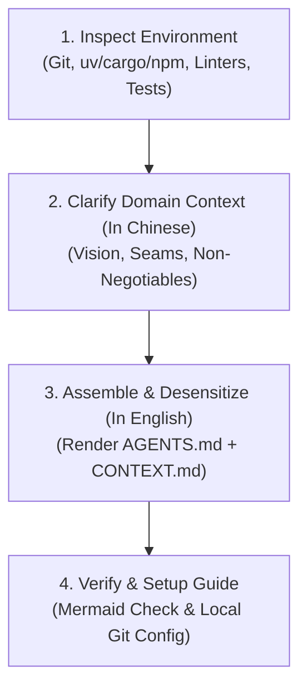

# init-agents

Generate a production-grade, compact, battle-tested `AGENTS.md` workflow constitution and domain `CONTEXT.md` for a new or existing repository. Enforces the Master-Worker multi-agent model, Git dual-trunk promotion discipline, zero-warning quality gates, truth integrity (zero synthetic fallback), and strict bot attribution desensitization.

> ⚠️ **Language & Size Invariants**:
> - **Human Interaction**: Always communicate, interview, and prompt the human developer in **Chinese**.
> - **Generated Documents**: The output `AGENTS.md` and `CONTEXT.md` MUST be written in **English** (for maximum LLM semantic compliance and token compactness).
> - **Anti-Bloat**: Keep `AGENTS.md` tight, authoritative, and under 150 lines. Push deep domain details behind context pointers (`CONTEXT.md`, `docs/SPEC.md`, `docs/adr/`).

## Workflow



---

## Step 1: Inspect Environment & Auto-Detect Stack

Examine the target repository root to determine the existing toolchain:

1. **Git Status**:
   - Check if repository is initialized: `git status` or `git rev-parse --is-inside-work-tree`.
   - Check default branches (`main`, `dev`, `master`) and enforce dual-trunk promotion: **Squash & Merge** into `dev` (linear micro-steps) and **Merge Commit** (`--no-ff`) into `main` (milestone integrity).
2. **Technology Stack & Package Manager**:
   - **Rust**: `Cargo.toml` ➔ `cargo clippy --all-targets -- -D warnings`, `cargo fmt --check`, `cargo test`
   - **Python (Modern `uv` / Standard)**: `pyproject.toml` (check for `uv.lock`) / `requirements.txt` ➔ `uv run ruff check` (or `ruff check`), `mypy`, `pytest`
   - **TypeScript / Frontend / Svelte 5**: `package.json` (check for Svelte 5 runes, Tailwind v4, Vite) ➔ `pnpm check` / `npm run lint` / `biome check`, `vitest`
   - **Go**: `go.mod` ➔ `golangci-lint run`, `go test ./...`
   - **MCP Servers**: Check if using FastMCP, standard stdio transports, or SSE.
3. **Existing Documentation**:
   - Check if `README.md`, `CONTEXT.md`, or previous `AGENTS.md` exists.

---

## Step 2: Clarify Domain Context & Iron Laws (Conduct in Chinese)

Conduct a brief 2~3 question interview in **Chinese** to lock in domain specificities:

1. **项目核心定位与愿景 (Project Vision & Scope)**:
   - 一句话描述本项目的核心使命是什么？
2. **最高测试接缝 (Highest Testing Seam)**:
   - 系统的单一切入点与外部可观测行为接口在哪里？（例如 CLI 入口、Engine Coordinator、API Controller，避免针对内部私有函数的脆弱 Mock）。
3. **不可妥协的领域硬铁律 (Non-Negotiable Project Iron Laws)**:
   - 哪 2~4 条核心业务/架构规则绝对不可违背？
   - *常见范例*:
     - 前端: "Zero-VDOM, 100% GPU compositor thread animations (`transform`/`opacity`/`clip-path`), zero business logic in showcase demos."
     - 量化/金融: "Zero naked delta, dynamic liquidity safety envelope, 4-leg fee amortization lock, zero synthetic data fallback."
     - 内存/系统: "Tests must never touch real user vault/data; use mock fixtures only; domain models immutable."
4. **双层工单体系偏好 (Issue Tracker Hierarchy)**:
   - 确认是否采用标准模式：L1 宏观需求挂钩 GitHub Issues (`#NN`)，L2 微观工单放在本地 `.scratch/<project>/issues/` 并在 PR 中通过 `Closes #NN` 闭环。

---

## Step 3: Assemble & Write Standard Documents (Generate in English)

Read `templates/AGENTS.md.template` (relative to this skill). Fill all variable placeholders in **English**:

- `{{PROJECT_NAME}}`: Project repository name
- `{{TECH_STACK_VERSION}}`: Target runtime/compiler version (e.g. `Rust 2021 (MSRV 1.75+)`, `Python 3.11+ (uv)`, `Svelte 5 (Runes) + Vite`)
- `{{PACKAGE_MANAGER}}`: e.g. Cargo, uv, pnpm, go
- `{{FORMAT_COMMAND}}`: Formatter check command
- `{{LINT_COMMAND}}`: Strict linter command (with zero-warning flag)
- `{{TEST_COMMAND}}`: Native test command
- `{{PROJECT_IRON_LAWS}}`: Bulleted non-negotiable rules gathered in Step 2

### ⚠️ Strict Desensitization Iron Rule (Never Inline Private IDs)

Under **NO** circumstances should you write the developer's real `App ID`, real `Bot User ID`, or personal bot email into `AGENTS.md`. Always keep abstract placeholders:
- `<bot_app_id>`
- `<bot_user_id>`
- `<bot-name>[bot]`
- `<bot_user_id>+<bot-name>[bot]@users.noreply.github.com>`

The real bot credentials are only ever injected dynamically at runtime via the developer's local git configuration (`git config --get agent.coauthor`).

Write the completed document to `<repo-root>/AGENTS.md`.

If `CONTEXT.md` does not yet exist, read `templates/CONTEXT.md.template`, populate the project description, and write it to `<repo-root>/CONTEXT.md` in English.

---

## Step 4: Verify & Local Environment Setup Guide

1. **Verify Generated Files**:
   - Inspect `AGENTS.md` to ensure:
     - Output is in **English** and remains compact (<150 lines).
     - All `{{...}}` placeholders are resolved.
     - Mermaid diagrams have valid syntax and enclosed labels.
     - No private tokens, real bot IDs, or sensitive paths are exposed.
2. **Check Local Git Co-Author Configuration**:
   - Run `git config --get agent.coauthor` in the repository.
   - If not set, provide the developer with the one-line setup command:
     ```bash
     # To configure globally across all repositories:
     git config --global agent.coauthor "Co-authored-by: <bot-name>[bot] <<bot_user_id>+<bot-name>[bot]@users.noreply.github.com>"
     ```
   - Explain the `Bot User ID` requirement (fetch from `https://api.github.com/users/<bot-name>[bot]` to get the real numerical user ID for GitHub stacked avatar credit).
